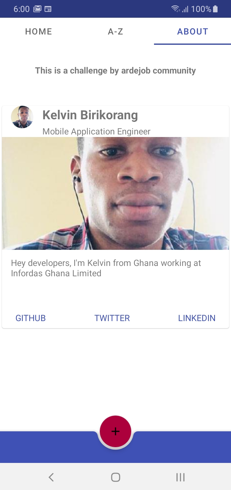
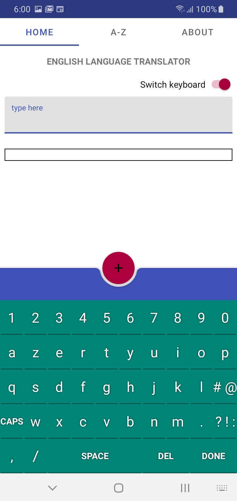
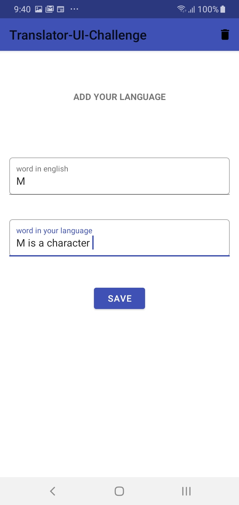
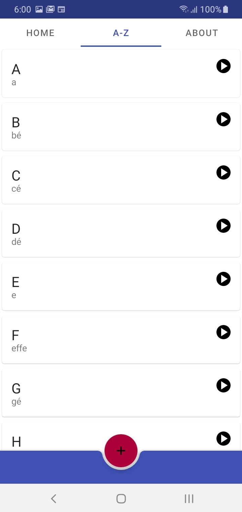
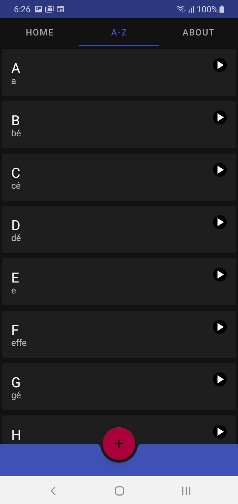

# Translator-UI-Challenge
 Language Translator Android App Challenge

 ## Ardejob community

Check their twitter handle https://twitter.com/ardejob

## Task Completed
* [x] Using Room db
* [x] Dark theme
* [ ] Firebase Crashlytics **my quota limit reached**
* [x] Leak canary2
* [x] bitrise CI
* [x] Enable Proguard
* [x] Custom keyboard (French layout)

## Translated Language
* [x] French
* [x] A-Z alphabet with sound

## Code Language
* [x] Kotlin

## Architecture
* [X] MVVM Architecture
* [x] Repository pattern

## Background Process
* [x] Coroutines

## UI Test
* [x] AddLanguageFragment
* [x] HomeFragment
* [x] SavedLanguages
* [x] AboutFragment

## APK File

## App Screenshots

|            About Page             |           Home Page            |
| :---------------------------------: | :----------------------------------: |
|  |  |

|            Add Alphabet Page             |           List Alphabet Page            |
| :---------------------------------: | :----------------------------------: |
|  |  |

|            Dark mode             |                      |
| :---------------------------------: | :----------------------------------: |
|  |

